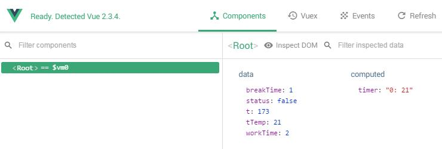

## 介绍

一个用 Vue 写的[番茄时钟](https://zh.wikipedia.org/wiki/%E7%95%AA%E8%8C%84%E5%B7%A5%E4%BD%9C%E6%B3%95)。

[Demo](https://codepen.io/monad/pen/JJgxoO?editors=0010#0)

## 功能

- [x] 在工作时间和休息时间循环倒计时

- [x] 点击暂停，再次点击继续计时

- [x] 倒计中可以重新设置工作/休息的时间